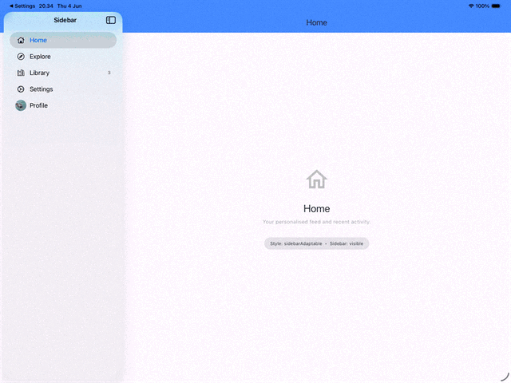

# ios_native_sidebar

A Flutter plugin that renders a **native iPadOS / iOS sidebar** using `UISplitViewController`, with iOS 26 **Liquid Glass** aesthetics. Adaptive by default — splits into a two-pane layout on iPad and collapses into a navigation stack on iPhone.



---

## Features

- Native `UISplitViewController` — real OS-level sidebar, not a Flutter drawer
- **iOS 26 Liquid Glass** background on the sidebar panel (`UIGlassEffect`), with a `UIBlurEffect` fallback on earlier OS versions
- Two style modes: `sidebarAdaptable` (collapsible) and `splitView` (always visible on iPad)
- Builder pattern — the content area is a Flutter widget that receives live `NativeSidebarState`
- Large title support with scroll-collapse behaviour
- SF Symbol icons **or** custom `ImageProvider` images (rendered as circular avatars)
- Badge labels per item
- Programmatic selection and show/hide control
- Pure-Flutter fallback for non-iOS platforms (`NavigationRail` on wide screens, `Drawer` on narrow)

---

## Platform support

| Platform | Support |
|---|---|
| iPadOS 16+ | ✅ Full native sidebar |
| iOS 16+ (iPhone) | ✅ Adaptive (navigation stack) |
| Android / Web / Desktop | ✅ Flutter fallback |

---

## Installation

```yaml
flutter pub add ios_native_sidebar
```

---

## Usage

Place `NativeSidebar` at the **root** of your widget tree. On iOS it replaces the app's root view controller with a `UISplitViewController`; the `builder` output fills the secondary (detail) column.

```dart
NativeSidebar(
  title: 'My App',
  style: NativeSidebarStyle.sidebarAdaptable,
  items: [
    const NativeSidebarItem(id: 'home',     title: 'Home',     sfIcon: 'house'),
    const NativeSidebarItem(id: 'explore',  title: 'Explore',  sfIcon: 'safari'),
    const NativeSidebarItem(id: 'library',  title: 'Library',  sfIcon: 'books.vertical', badge: '3'),
    NativeSidebarItem(id: 'profile', title: 'Profile', image: const AssetImage('assets/avatar.png')),
  ],
  selectedItemId: _selectedId,
  onItemSelected: (item) => setState(() => _selectedId = item.id),
  builder: (context, state) {
    return switch (state.selectedItemId) {
      'home'    => const HomeScreen(),
      'explore' => const ExploreScreen(),
      'library' => const LibraryScreen(),
      'profile' => const ProfileScreen(),
      _         => const HomeScreen(),
    };
  },
)
```

---

## NativeSidebar parameters

| Parameter | Type | Default | Description |
|---|---|---|---|
| `style` | `NativeSidebarStyle` | required | `sidebarAdaptable` or `splitView` |
| `items` | `List<NativeSidebarItem>` | required | Sidebar rows |
| `builder` | `NativeSidebarBuilder` | required | Detail content builder |
| `title` | `String?` | `null` | Navigation bar title |
| `largeTitleDisplayMode` | `bool` | `true` | Large title that collapses on scroll |
| `selectedItemId` | `String?` | `null` | Currently highlighted item |
| `onItemSelected` | `ValueChanged<NativeSidebarItem>?` | `null` | Tap callback |

### NativeSidebarState (passed to builder)

| Property | Type | Description |
|---|---|---|
| `isSidebarVisible` | `bool` | Whether the sidebar panel is currently on screen |
| `selectedItemId` | `String?` | ID of the currently selected item |

### NativeSidebarItem

| Parameter | Type | Description |
|---|---|---|
| `id` | `String` | Unique identifier |
| `title` | `String` | Row label |
| `sfIcon` | `String?` | SF Symbol name (e.g. `'house'`, `'gear'`) — takes priority over `image` |
| `image` | `ImageProvider?` | Any Flutter image provider; rendered as a circular avatar |
| `badge` | `String?` | Trailing badge text |

---

## Style modes

### `sidebarAdaptable`
- **iPad**: sidebar is collapsible via the native toolbar toggle button or swipe gesture
- **iPhone**: full-screen content with sidebar accessible as a slide-in sheet

### `splitView`
- **iPad**: sidebar is always visible beside the content
- **iPhone**: sidebar becomes the root screen; selecting an item pushes the detail content

---

## License

MIT
